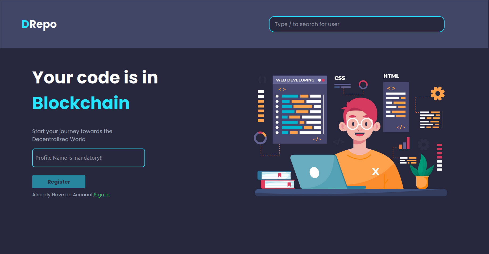

# DRepo

DRepo is a decentralized web-based code storage platform made with Ethereum Blockchain. 

### Home Page Ui


## Installation

1. Clone the repository:

   ```bash
   git clone https://github.com/dipayandas24/DRepo_TDoC.git
   cd DRepo_TDoC
   ```
2. Install dependencies:

    - Navigate to the frontend folder:

    ```bash
    cd frontend
    npm install
    ```
    - Return to the root directory and install Truffle dependencies:

     ```bash
     npm install -g truffle
     ```

3. Compile smart contracts:

     ```bash
     truffle compile
     ```
4. Migrate smart contracts to the local blockchain or testnet:

     ```bash
     truffle migrate
     ```

## Running the Application

1. Start the local Ethereum blockchain (if using Ganache):

```bash

ganache-cli
```

2. Run the frontend:

```bash

cd frontend
npm start
```

3. Open the application in your browser at `http://localhost:3000`.

## Smart Contract Testing

To run tests for the smart contracts, use the following command:

```bash

truffle test
```
